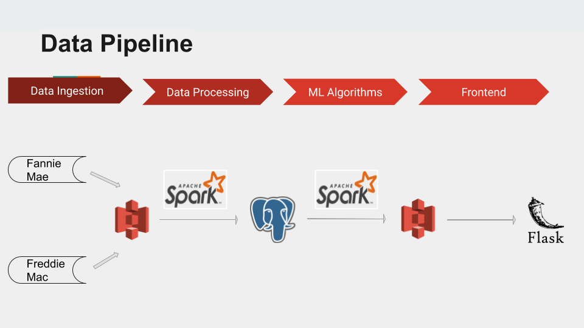

# MortgagePrediction
Build a pipeline to integrate mortgage datasets from various sources and predict the mortgage default by applying ML models

# Motivation
Mortgage is a very important financial sector in US. Mortgage default could cause big losses for banks and mortgage providers, even a national economics crisis which has already happened in 2008.

Hence, managing the risk of mortgage dafault is important for participants in this market.

In this project, I used big data technologies such as AWS S3, Spark, PostgreSQLon AWS to build a pipeline to ingest, process and combine the mortgage datasets released by Freddie Mac and Fannie Mae, and also applied ML models to predict the mortgage default.

# Overview
This project aims at creating a data pipeline for integrating the multiple datasets about single-family mortgage loans and training a robust machine learning model to predict the mortgage default.

Raw data are released by Freddie Mac and Fannie Mae, which are the top two goverment-sponsored enterprises in US.



Following along the pipeline, I first ingest the dataset with a total size of 254.6G from the Fannie Mae and Freddie mac to AWS S3; clean, tranforming and combing the data in Spark, and then save the clean dataset in Postgres; traning the ML models in Spark and deploy the model at Flask.

The structure of the directory is mapped according to this tree:

    |- data_pipeline.png
    |- README.md
    |- db
        |- schema.sql
    |- flask
        |- run.py
        |- views.py
        |- requirements.txt
    |- src
        |- create_table.py
        |- ml_postgres.py
        |- freddie_prepare.py
        |- fannie_prepare.py
        
## Notes on setting the environment

1. Following this [pegasus](https://blog.insightdatascience.com/how-to-get-hadoop-and-spark-up-and-running-on-aws-7a1b0ab55459) 
instruction to start a spark cluster on EC2 instances. In this case, there are 3 workers and 1 master all on m4.large 
2. Install all the necessary packages according to requirements.txt.
3. Configure for Spark History Server. 
    - Useful [link](https://www.ibm.com/support/knowledgecenter/en/SS3MQL_1.1.1/management_sym/spark_configuring_history_service.html)
     on how to configure spark history server.
        
        ```
    - Start the spark service
        ```
        $cd /usr/local/spark/sbin/ && sudo ./start-history-server.sh

    - And now WebUI with port 8080 should work.
4. Configure for connecting to Postgres Database, in this case hosted in another m4.Large EC2 instance.

    - Two conf files need to be changed on the server(10 is the Postgres version): 
        ```/etc/postgresql/10/main/pg_hba.conf``` and ```/etc/postgresql/10/main/postgresql.conf```
    - In pg_hba.conf file, (use sudo) go to the very end of the file. Add this line
    ```host    all             all              10.0.0.1/24            md5```
    where ```10.0.0.x``` is the private DNS address of my compute EC2 instances
    - In ```postgresql.conf``` file, go to Connection Settings. Change the listening address to: 
    ```listen_addresses = '*'```
    - Restart your postgresql: ```$sudo service postgresql start```
    
    - Check the status again:  ```$sudo service postgresql status```
5. Run Spark 
```
export PYSPARK_PYTHON=python3;
export SPARK_CLASSPATH= <path to downloaded jar>/postgresql-42.2.8.jar

pyspark
spark-submit --driver-class-path <path to downloaded jar>/postgresql-42.2.8.jar  <file_name>.py


