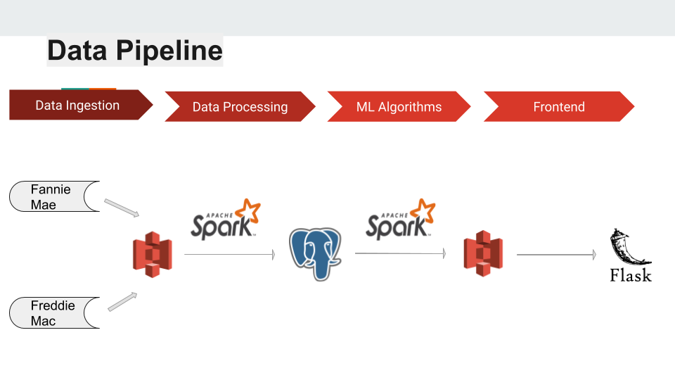

# MortgagePrediction
Build a pipeline to integrate mortgage datasets from various sources and predict the mortgage default by applying ML models

# Motivation
Mortgage is a very important financial sector in US. Mortgage default could cause big losses for banks and mortgage providers, even a national economics crisis which has already happened in 2008.

Hence, managing the risk of mortgage dafault is important for participants in this market.

In this project, I used big data technologies such as AWS S3, Spark, PostgreSQLon AWS to build a pipeline to ingest, process and combine the mortgage datasets released by Freddie Mac and Fannie Mae, and also applied ML models to predict the mortgage default.

# Overview
This project aims at creating a data pipeline for integrating the multiple datasets about single-family mortgage loans and training a robust machine learning model to predict the mortgage default.

Raw data are released by Freddie Mac and Fannie Mae, which are the top two goverment-sponsored enterprises in US.

Following along the pipeline, I first ingest the dataset with a total size of 254.6G from the Fannie Mae and Freddie mac to AWS S3; clean, tranforming and combing the data in Spark, and then save the clean dataset in Postgres; traning the ML models in Spark and deploy the model at Flask.

The structure of the directory is mapped according to this tree:

    |- data_pipeline.png
    |- README.md
    |- db
        |- schema.sql
    |- flask
        |- run.py
        |- views.py
        |- requirements.txt
    |- src
        |- create_table.py
        |- ml_postgres.py
        |- freddie_prepare.py
        |- fannie_prepare.py

